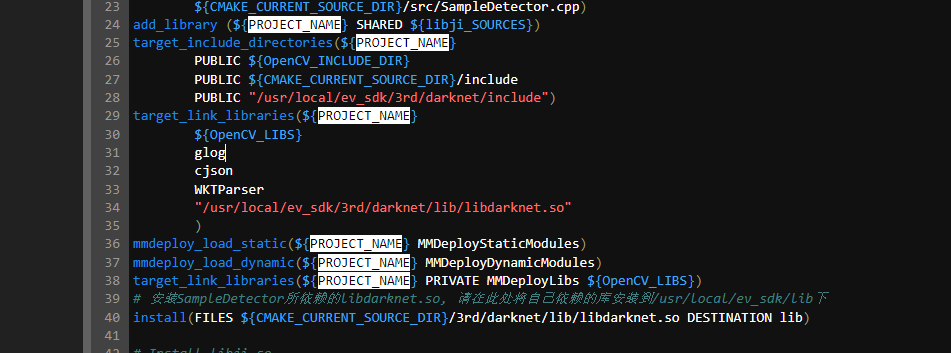

 - 问题1
* 

- 第38行，由于属性不统一导致错误
- 解释：

    Cmake中，用target_include_directories,target_link_libraries时，模式要一致。要么都加上PUBLIC/PRIVATE的属性。要么都不加加上是cmake比较推荐的,mmdeploy中都是加了的.

- 极视的 cmakelistfile.txt 示例：
    ```
    #sdk 4.0
    cmake_minimum_required(VERSION 3.5)
    project(ji)
    
    set(CMAKE_CXX_STANDARD 11)
    set(CMAKE_INSTALL_PREFIX "/usr/local/ev_sdk")
    set(CMAKE_INSTALL_RPATH "${CMAKE_INSTALL_PREFIX}/lib")
    set(MMDeploy_DIR /project/ev_sdk/3rd/mmdeploy/lib/cmake/MMDeploy)
    # 使用pkg-config查找必要的依赖包
    find_package(OpenCV REQUIRED)
    find_library(glog REQUIRED)
    find_package(MMDeploy REQUIRED)
    set(ENV{PKG_CONFIG_PATH} "ENV{PKG_CONFIG_PATH}")
    find_package(PkgConfig REQUIRED)
    
    add_subdirectory(${CMAKE_CURRENT_SOURCE_DIR}/3rd/cJSON)
    add_subdirectory(${CMAKE_CURRENT_SOURCE_DIR}/3rd/wkt_parser)
    #add_subdirectory(${CMAKE_CURRENT_SOURCE_DIR}/3rd/mmdeploy/example)
    set(CMAKE_INSTALL_RPATH "${CMAKE_INSTALL_RPATH}:/usr/local/ev_sdk/lib")
    
    # 编译libji.so
    list(APPEND libji_SOURCES
            ${CMAKE_CURRENT_SOURCE_DIR}/src/ji.cpp
            ${CMAKE_CURRENT_SOURCE_DIR}/src/SampleDetector.cpp)
    add_library (${PROJECT_NAME} SHARED ${libji_SOURCES})
    target_include_directories(${PROJECT_NAME}  
            PUBLIC ${OpenCV_INCLUDE_DIR}
            PUBLIC ${CMAKE_CURRENT_SOURCE_DIR}/include
            PUBLIC "/usr/local/ev_sdk/3rd/darknet/include")
    target_link_libraries(${PROJECT_NAME}
            ${OpenCV_LIBS}
            glog
            cjson
            WKTParser
            "/usr/local/ev_sdk/3rd/darknet/lib/libdarknet.so"
            )
    mmdeploy_load_static(${PROJECT_NAME} MMDeployStaticModules)
    mmdeploy_load_dynamic(${PROJECT_NAME} MMDeployDynamicModules)
    target_link_libraries(${PROJECT_NAME} MMDeployLibs ${OpenCV_LIBS})
    # 安装SampleDetector所依赖的libdarknet.so, 请在此处将自己依赖的库安装到/usr/local/ev_sdk/lib下
    install(FILES ${CMAKE_CURRENT_SOURCE_DIR}/3rd/darknet/lib/libdarknet.so DESTINATION lib)
    
    # Install libji.so
    install(TARGETS ${PROJECT_NAME} DESTINATION lib)
    
    # ---  END EV_SDK DEPENDENCIES  ---
    ```
 
 
 - 问题2： 
 当出现找不到某个.so文件的解决方法：
    ```
     find / -name '*.so ' 去找一下这个文件是否存在，如果存在但是显示找不到，则设置**library_path**环境  变量
    ```
 - 编译的一般流程：
    ```
        mkdir build && cd build 
        cmake .. (这边指的是外部要有camke*.txt) 相当与link的操作，去寻找所需要的所有依赖
        make install 
     ```